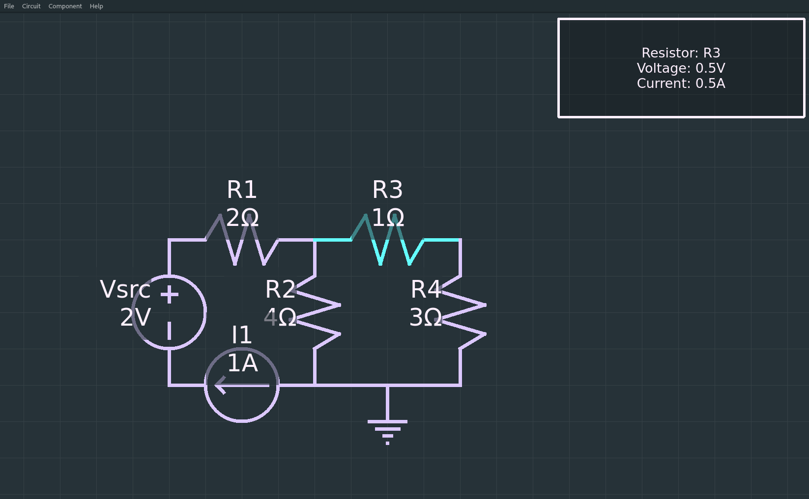

# Circuit Analysis Tool
*Martin Duffy*

A tool for linear circuit analysis

### Current Status
This project is in early stages and not yet functional.
See milestone checklist in [the project proposal](docs/proposal.md) for project status.

### Running
`pip install -r requirements.txt`

`python app.py`

### Screenshots

